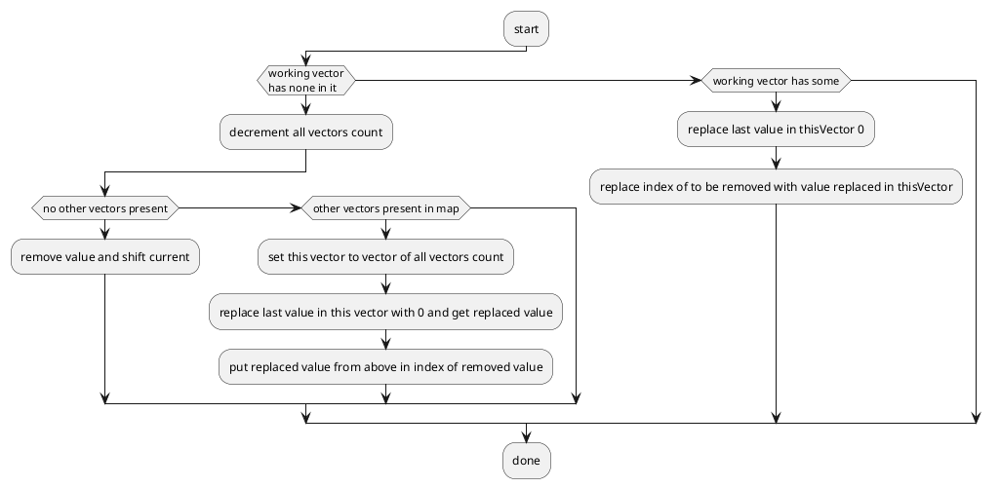

```puml

@startuml

:start;

if (working vector\nhas none in it) then
    :decrement all vectors count;
    if (no other vectors present) then
        :remove value and shift current;
    else if (other vectors present in map) then
        :set this vector to vector of all vectors count;
        :replace last value in this vector with 0 and get replaced value;
        :put replaced value from above in index of removed value;
    endif
else if (working vector has some) then
    :replace last value in thisVector 0;
    :replace index of to be removed with value replaced in thisVector; 
endif

:done;
@enduml

```